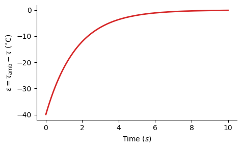

#### 

## Inspiration in Nature

Most days I like to go to the cafe and read a book whilst drinking a cappuccino.

    
     
    <em> Figure 1. A delicious cappuccino from Coffee on the Crescent, in Leeds. </em>

The speed with which the coffee cools is proportional to the ambient temperature. We would model it using a differential equation:
$$
\dot{\tau}(t) = -k\cdot\left(\tau_{amb.} - \tau(t)\right) \tag{1}
$$
where:
- $\tau(t)\in\mathbb{R}$ is the temperature of the coffee ($^{\circ}$C),
- $\dot{\tau}(t) = \frac{d\tau}{dt}$ is its time derivative ($^{\circ}$C/s),
- $\tau_{amb.}\in\mathbb{R}$ is the ambient temperature ($^{\circ}$C), and
- $k\in\mathbb{R}$ is some constant (1/s).

If we plot $\tau(t)$ over time, we will see that it decays asymptotically to zero:

    
     
    <em> Figure 2. The temperature of the coffee decays asymptotically toward the ambient temperature.</em>

We would model this relationship as an exponential equation:

$$
\tau(t) = e^{-kt}\tau(0) + (1 - e^{-kt})\tau_{amb.}. \tag{2}
$$

This form is a cumbersome to work with, but a neater expression would be to look at how the \emph{difference} in temperature changes over time:
$$
\begin{align}
         \epsilon(t) &= \phantom{-}\tau_{amb.} - \tau(t) \\
   \dot{\epsilon}(t) &= -k\cdot\underbrace{\left(\tau_{amb.} - \tau\right)}_{\epsilon(t)} \tag{3}
\end{align}
$$

    
     
    <em> Figure 3. The difference in temperature also follows an exponential decay.</em>

This serves as a nice basis for formulating control problems because we can see that:
1. The difference, or "error", will decay to zero over time,
2. It does so smoothly since the exponential function is infinitely differentiable, and
3. Exponential growth & decay are natural phenomena.

The third point is salient because all the autonomous system we wish to control are bound by the laws of physics. When we formulate control problems on the basis of natural principles we not only get nice behaviour, but the resulting equations provide meaningful insight.

## How to Solve Every Control Problem

There are 3 simple steps to solving (almost) every control problem:
1. Define the error $\boldsymbol{\epsilon}$,
2. Examine how the error evolves over time $\dot{\boldsymbol{\epsilon}}$, and
3. Design the control input so the error decays to zero.

## First Order Systems

Suppose we have some general configuration (i.e. position) vector for an autonomous system:
$$
\mathbf{x} =
\begin{equation}
    x_1 \\
    \vdots \\
    x_m
\end{equation} \in\mathbb{R}^m \tag{4}
$$

Define the error from a desired configuration $\mathbf{x}_d$ as:
$$
    \boldsymbol{\epsilon} = \mathbf{x}_d - \mathbf{x} \tag{5}
$$

Time derivative of the error:
$$
    \dot{\boldsymbol{\epsilon}} = \dot{\mathbf{x}}_d - \dot{\mathbf{x}}
$$

We want:
$$
    \dot{\boldsymbol{\epsilon}} = -\mathbf{K}\boldsymbol{\epsilon}
$$

Equating:
$$
\begin{align}
    \overbrace{\dot{\mathbf{x}}_d - \dot{\mathbf{x}}}^{\dot{\boldsymbol{\epsilon}}} &= -\mathbf{K}\boldsymbol{\epsilon} \\
    \Longrightarrow \dot{\mathbf{x}} &= \dot{\mathbf{x}}_d + \mathbf{K}\boldsymbol{\epsilon}.
\end{align}
$$

## Eigenvectors & Eigenvalues

## Second Order Systems

We follow the same procedure as before:
1. Define the error, and
2. Calculate the time derivative - twice.
$$
\begin{align}
    \boldsymbol{\epsilon}        &= \mathbf{x}_d - \mathbf{x} \\
    \dot{\boldsymbol{\epsilon}}  &= \dot{\mathbf{x}}_d - \dot{\mathbf{x}} \\
    \ddot{\boldsymbol{\epsilon}} &= \ddot{\mathbf{x}}_d - \ddot{\mathbf{x}}
\end{align}
$$
The trick here is to form an equivalent first order system by using a state space vector (combining the configuration and velocity together):
$$
\begin{bmatrix}
    \dot{\boldsymbol{\epsilon}} \\
    \ddot{\boldsymbol{\epsilon}}
\end{bmatrix}
=
\begin{bmatrix}
    \mathbf{0} & \mathbf{I} \\
    ? & ?
\end{bmatrix}
\begin{bmatrix}
    \boldsymbol{\epsilon} \\
    \dot{\boldsymbol{\epsilon}}
\end{bmatrix}
$$

