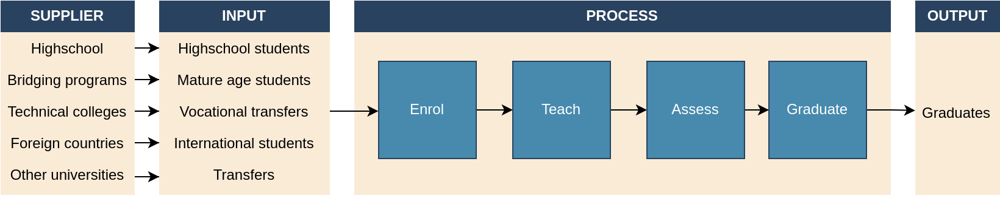
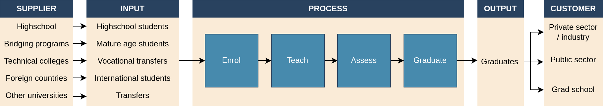
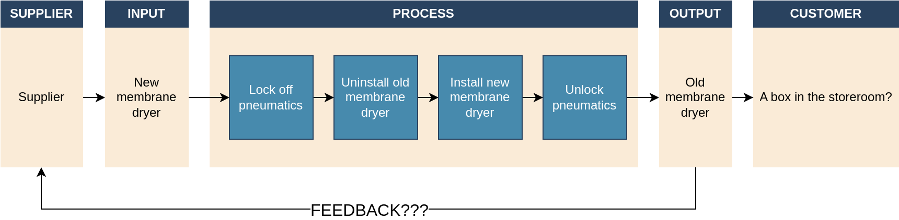

> Who is the customer of your business? Who receives the output of your work? Surprisingly, it's not always who you think, and in this article I'd like to demonstrate why. The SIPOC is a fundamental tool in the Lean Six Sigma project management method. When done correctly, it can reveal important insights in to a business process. It's an important step before establishing quality metric and key performance indicators of your work.

### 🧭 Navigation
- [Whom Do You Serve?](#whom-do-you-serve)
    - [A Thought Exercise](#a-thought-exercise)
- [SIPOC](#sipoc)
    - [Example \#1: Train Membrane Dryers](#example-1-train-membrane-dryers)
    - [Example \#2: Lamingtons](#example-2-baking-lamingtons)
    - [Example \#3: How Not To Do a SIPOC](#example-3-how-not-to-do-a-sipoc)
- [Key Takeaways](#key-takeaways)

## Whom Do You Serve?

Lean Six Sigma (LSS) is a project management methodology used to optimise the performance of business and engineering processes. It combines the heuristics for process optimisation from Toyota's Lean production with statistical process control from Motorola's Six Sigma.

An LSS project is divided in to 5 phases:
1. Define the problem,
2. Measure the current performance,
3. Analyse root causes of the problem
4. Improve the process, and
5. Control the process.

This is abbreviated as DMAIC.

A core principle of LSS is to define the quality of a product or service with respect to the customer; not what the business itself believes. As such, one the first steps in the Define phase of a project is to:
1. Identify who the customer of a product / service is, and
2. Use this to define measures of quality, product specifications, key performance indicators, etc.

There is a canonical tool that we use to help articulate this. But before introducing it, I want to take you through a thinking exercise. Hopefully it will show the value in applying this tool correctly, but also the utility of using project management tools as structured thinking.

### A Thought Exercise

Who is the customer for a Bachelor's degree program at a university? The student? The student pays for the tuition fees, therefore the student is the customer, right? This is the wrong way to think about it, and I will demonstrate why.

First let's think of the Bachelors degree program as a process. The basic steps are:
1. Enrol students,
2. Teach students,
3. Assess students, then 
4. Graduate (or fail!).

Next, who enrols in to the university system?
- Highschool graduates,
- Mature-age people,
- Vocational transfers (e.g. tradespeople),
- International students,
- Transfer students.

And what comes out?
- A graduate.

Now we have a clearly defined Input-Process-Output.

    

#### The Supplier

The next important step is to identify where all these inputs come from:
- High schools
- Technical / vocational colleges
- Bridging programs
- Other universities

These are the suppliers. It is important to connect them directly to inputs so we can trace problems back to the origin.

    

#### The Customer

Finally, where do all these graduates go?
- Private sector / industry,
- Public sector, and
- Grad schools.

    

These are the customers of a graduate degree program. In light of this, _students are the *product*, not the customer_. This means we should frame the key performance indicators of a Bachelor's degree program with respect to the customer's requirements.

If we were to begin by naively asking "What makes a good University?" at the beginning of the project, then we might answer with things like:
- Campus facilities,
- Cost of tuition,
- Study spaces,
- Food & dining,
- Social groups,
- etc.

But this will lead us to the wrong conclusions since this tells us nothing about the quality of the students coming out of the program.

Instead, by asking the customer, we might get responses like:
- Subject matter expertise,
- Communication skills,
- Initiative & independence,
- Teamwork,
- etc.

Of course, the KPIs will be specific to the field of study. I'm an engineer, so I would frame in terms of mathematical ability, programming skills, ability to use software. Whereas a degree like history might emphasise knowledge, writing, and research synthesis.

In light of this, we might measure the quality of graduates through things like:
- Employment rate,
- Customer satisfaction surveys,
- Starting salaries,
- Graduate outputs like publications or patents,
- etc.

Admittedly, there is a danger in treating scholasticism as business. A University degree may devolve in to merely producing technical competencies, rather than the development of the intellect. This should be the purview of technical colleges, in my opinion, but I digress.

[⬆️ Back to top.](#top)

## SIPOC

The Supplier-Input-Process-Output (SIPOC) tool is a staple of the Define phase in a Six Sigma project. Its purpose is to:
- Provide a high-level process for project stakeholders,
- Identify suppliers (as potential sources of error), and
- Identify customers.

Firstly, knowing who is supplying the inputs to a process can be an important first step in resolving quality issues in a product or process. In LSS there is the adage "rubbish in = rubbish out". If we are receiving poor quality materials & products from our suppliers, this can cause issues within our processes.

Second, having a high-level process map can help with early identification of potential problem areas in the system.

Third, identifying the customer is integral to the success of the project. The next step in the Define phase is usually to develop the Voice of the Customer (VoC). This often involves interviews and focus groups to obtain primary evidence about what the customer actually wants, versus internal opinions within the business itself.

It is also important for establish the product or service specifications (critical to quality factors). By knowing who the customer is, we define quality with respect to their needs. This metrics are what we use in the later phases of the project:
- Measure: Determining how close the current performance is to the customer requirements.
- Improve: Demonstrating the new process meets or exceeds customer requirements.
- Control: Monitoring the process with respect to customer requirements.

[⬆️ Back to top.](#top)

### Example \#1: Train Membrane Dryers

When I was working for Sydney Trains, circa 2013, I did a sabbatical over the summer as a train technician. One thing we had to do was replace faulty membrane dryers from the trains. These were devices that removed moisture from the air before it entered all the pneumatic systems on the train. They were failing quite frequently, and were being replaced often.

When I went back to corporate in the Autumn, I was sitting in on the Six Sigma Green Belt training course. Since I was already employed in the Six Sigma group, I ended up helping other students with their projects. One of the engineering managers was investigating why they were not working. We developed the SIPOC, and, having worked on the trains myself, I added some subject matter expertise.

I told him the output is the defective membrane dryer, and we should define who receives it. It turns out they get put in a box in the storeroom. The supplier was never informed of the problem.

    

Immediately, just from working on the SIPOC, we identified a crucial broken point in the overall system. How can our suppliers fix the problem if they haven't received a defective one to inspect? This might have fixed the problem immediately if our suppliers had been informed.

To me this highighted 2 important things:
1. Being diligent with project management tools, because they can reveal vital information, and
2. The necessity of formal feedback to our suppliers when their products aren't working as intended.

[⬆️ Back to top.](#top)

### Example \#2: Baking Lamingtons

Lamingtons are an Australian delicacy. They are a sponge cake, coated in chocolate sauce, and dipped in coconut shavings. They are best enjoyed with tea or coffee.

    

When I was living in Italy, I baked lamingtons for my friends & colleagues. The very first batch I ever made turned out perfectly. All the batches after were poor quality; too firm, too dry. I made this as part of the [Six Sigma online course](https://www.edx.org/learn/six-sigma/technische-universitat-munchen-six-sigma-define-and-measure) that I'm a guest lecturer for.

    

Some key insights from this example are:
- I only listed inputs that are transformed by the process. All the kitchen utensils are not considered in this tool.
- Waste products are an output. I had a lot of leftover coconut shavings. I could control my baking process by carefully measuring how much coconut I need to cover a given surface area of cake.
- The baking paper is pure waste. It might be better to use a non-stick pan instead.

I never actually figured out what was wrong, but I suspect it was the flour with raising agent which had lost its potency. This is a good learning lesson; check the quality of the inputs (ChatGPT suggested to test the reaction of the flour to warm water).

[⬆️ Back to top.](#top)

### Example \#3: How NOT to do a SIPOC

I asked ChatGPT to generate a SIPOC based on the university Bachelor's degree program example above. Since the AI learns from examples on the internet, I think its amalgamated many poor habits when developing a SIPOC.

    

Here are what I think it's done wrong, or poorly:
- ❌ Listing facult & staff as an input. These are not transformed by the process, so they should not be considered in the SIPOC. The effect that staff have on student quality should be considered in the Analyse phase of the project.
- ❌ Not connecting suppliers to inputs,or outputs to customers. Who supplies the academic records? How can we trace it back if there are errors? Who receives "completed courses"?
- ❌ Listing completed courses as an output. The course itself is not a product or service, only a process. Who is its customer?
- ❌ Silos. Components are visually separated in to S, I, P, O, and C boxes. It doesn't illustrate _process flow_.

What I do think was good was:
- ✅ Listing the degree (or academic record maybe?) as a process output. Often these are required by employers as evidence of credentials.

[⬆️ Back to top.](#top)

## Key Takeaways

To summarise, a diligent application of the SIPOC is crucial to correctly identifying the customer of business process. This will frame how quality and key performance indicators are developed. It can also provide early insight in to potential problem areas for further investigation (or identify them immediately!).

Some tips I think

- Link every input to a customer. Rubbish in = rubbish out, so its important to trace defects back to their source.
- Match every output to a customer. It's important to identify who is receiving them (if at all!).
- Waste should be recorded as an output.
- Only list things that are transformed by the process. This is integral for identifying "value-add" process steps (work that produces value, and hence revenue).
- Try identify feedback channels to the supplier.

[⬆️ Back to top.](#top)