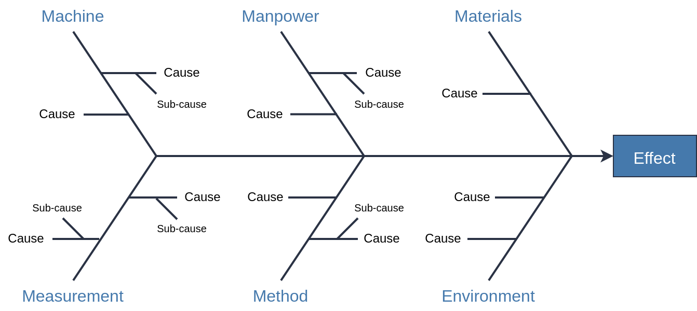

## The Ishikawa, or Fishbone Diagram

    
     
    <em> Caption. </em>

## Case Study: Monthly Train Inspections

### The Problem

### Root Cause Analysis

    
     
    
     
    <em> Caption. </em>

    
     
    <em> Caption. </em>

### The Solution

## Tips for Fishbone Diagrams

### A General Process

1. Gather a team of subject matter experts for a workshop.
2. Brainstorm all the possible causes of the problem.
    - Everybody gets $N / 3$ votes, were $N$ is the number of ideas.
3. Vote on the most likely causes.
    - Consider removing causes.
4. Organise the results
    - Affinity diagrams.
    - Pareto chart.