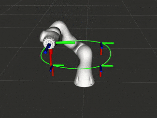

> When inverting the Jacobian of a robot arm, we may encounter a singularity. This can cause the robot to lose control. To circumvent this, we can use a control barrier function to prevent the robot from entering a (near) singular configuration.

#### 🧭 Navigation:
- [Resolved Motion Rate Control](#resolved-motion-rate-control)
- [Singularities](#singularities)
- [Manipulability](#manipulability)
- [Control Barrier Functions](#control-barrier-functions)
- [Singularity Avoidance](#singularity-avoidance)
- [In Practice](#in-practice)

It is often useful to dictate the velocity of the endpoint of a robot arm directly, rather than move it between two fixed endpoint poses in pick-and-place tasks. To do this, we need to resolve all the joint velocities simultaneously to achieve it. This was first proposed by Whitney in 1969, and denoted _resolved motion rate control_ (RMRC)[^1].

[1]: D. E. Whitney, "Resolved Motion Rate Control of Manipulators and Human Prostheses," in IEEE Transactions on Man-Machine Systems, vol. 10, no. 2, pp. 47-53, June 1969, doi: 10.1109/TMMS.1969.299896

Below are some animated gifs of robots that I have programmed with RMRC:

    
    
    
     
    <em> The endpoint velocity of a robot arm can be instantaneously controlled with resolved motion rate control. </em>

## Resolved Motion Rate Control

We start with the forward kinematics, which expresses the pose of the endpoint $\mathbf{x}\in\mathbb{R}^m$ as a function of the joint configuration $\mathbf{q}\in\mathbb{R}^n$:
$$
    \mathbf{x} = \mathbf{f}(\mathbf{q}). \tag{1}
$$
By taking the time derivative, and using the chain rule, we obtain the endpoint velocity with respect to the joint velocities:
$$
    \dot{\mathbf{x}} = \underbrace{\big(\partial\mathbf{f}/\partial\mathbf{q}\big)}_{\mathbf{J}(\mathbf{q})}\dot{\mathbf{q}} \tag{2}
$$
where $\mathbf{J}(\mathbf{q})\in\mathbb{R}^{m\times n}$ is the Jacobian matrix. 

Then, given a desired $\dot{\mathbf{x}}$ we can solve for the joint veloctieis:
$$
    \dot{\mathbf{q}} = \mathbf{J}^{\dag}\dot{\mathbf{x}} \tag{3}
$$
where $\mathbf{J}^\dag$ is the (pseudo)inverse of the Jacobian:
$$
    \mathbf{J}^\dag =
    \begin{cases}
        \big(\mathbf{J}^T\mathbf{J}\big)^{-1}\mathbf{J}^T & \text{for } m > n\\
        \mathbf{J}^{-1} & \text{for } m = n \\
        \mathbf{J}^T\big(\mathbf{JJ}^T\big)^{-1} & \text{for } m < n
    \end{cases}. \tag{4}
$$

[🔝 Back to Top.](#top)

## Singularities

In certain configurations the inverse of the Jacobian does not exist: $\nexists\mathbf{J}(\mathbf{q})^\dag$. This is known as a singularity. To understand why, one method of analysis is the singular value decomposition (SVD):
$$
    \mathbf{J} = \mathbf{U}
    \underbrace{
    \begin{bmatrix}
        s_1 &        & \\
            & \ddots & \\
            &        & s_m
    \end{bmatrix}}_{\mathbf{S}} \mathbf{V}^T \tag{5}
$$
where:
- $\mathbf{S}$ is a diagonal matrix of singular values, 
- $\mathbf{U}\in\mathbb{O}(m)$,
- $\mathbf{V}\in\mathbb{O}(n)$, and
- $\mathbb{O}$ denotes the orthogonal group:
$$
    \mathbb{O}(k) = \set{\mathbf{Q}\in\mathbb{R}^{k\times k} ~|~ \mathbf{Q}^T\mathbf{Q} = \mathbf{I}~,~ det(\mathbf{Q}) = \pm 1 }. \tag{6}
$$

We may then write the (pseudo)inverse of the Jacobian as:
$$
    \mathbf{J}^\dag = \mathbf{V}
    \begin{bmatrix}
        s_1^{-1} &        & \\
                 & \ddots & \\
                 &        & s_m^{-1}
    \end{bmatrix}
    \mathbf{U}^T \tag{7}
$$

The singular values are always arranged from largest to smallest. Thus, when $s_m = 0$ then $s_m^{-1}$ is undefined, and so is the (pseudo)inverse of the Jacobian.

Moreover, we can see from Eqn. (3) that as $s_m \to 0$ then $s_m^{-1}\to \infty$, and the joint velocities increase to infinity, causing the robot to lose control.

[🔝 Back to Top.](#top)

## Manipulability

Yoshikawa proposed the manipulability index[^2] which is a measure of proximity to a singularity:
$$
    \mu(\mathbf{q}) = \sqrt{det\big(\mathbf{J}(\mathbf{q})\mathbf{J}(\mathbf{q})^T\big)}. \tag{8}
$$

[2]:Yoshikawa, Tsuneo. "Manipulability of robotic mechanisms." The international journal of Robotics Research 4.2 (1985): 3-9.

By applying Eqn. (5) the measure of manipulability can be expressed as the product of singular values:
$$
    \mu(\mathbf{q}) = \prod_{i=1}^{m} s_i. \tag{9}
$$
Thus, when the robot is in a singular configuration $s_m = 0$ and $\mu = 0$. One of the advantages of using Eqn. (8) compared to Eqn. (5) is the speed of computation.

Manipulability is zero at a singular configuration, but also has a finite upper bound:
$$
    \mu(\mathbf{q}) \in [0, \infty).\tag{10}
$$

For robots with few degrees of freedom (DoF), we can plot this as a surface. The figure below shows the manipulability for a 3 DoF planar robot[^3]

[3]: Note that $\partial \mu/\partial q_1 = 0$.

    
     
    <em> Plot of manipulability for a 3-link, planar robot. </em>

[🔝 Back to Top.](#top)

## Control Barrier Functions

Suppose we have some function $b(\mathbf{q}):\mathbb{R}^n\mapsto\mathbb{R}$ that measures safety for a robot (e.g. distance to an obstacle, distance to a singularity, etc.). The safe set of configurations $\mathbf{q}$ is defined where said function is greater than, or equal to, zero:
$$
    \mathcal{S} = \set{\mathbf{q}\in\mathbb{R}^n ~|~ b(\mathbf{q}) \ge 0} \tag{11}
$$
and the boundary set is:
$$
    \mathcal{B} = \set{\mathbf{q}\in\mathbb{R}^n ~|~ b(\mathbf{q}) = 0}. \tag{12}
$$
A necessary condition for this function is that it is differentiable at the boundary:
$$
    \forall\mathbf{q}\in\mathcal{B} : \frac{\partial b}{\partial\mathbf{q}} \ne \mathbf{0}. \tag{13}
$$
This implies that we can leave the boundary by following the gradient vector.

It becomes a control barrier[^4] when we impose the following constraint on the joint velocities:
$$
\begin{align}
    \dot{b}(\mathbf{q},\dot{\mathbf{q}}) + \alpha\big(b(\mathbf{q})\big) &\ge 0  \tag{14a} \\
    \Longrightarrow \dot{b}(\mathbf{q},\dot{\mathbf{q}}) &\ge -\alpha\big(b(\mathbf{q})\big). \tag{14b}
\end{align}
$$
where $\alpha$ is a monotonically increasing function:
$$
    \alpha\big(b(\mathbf{q})\big) \ge b(\mathbf{q}). \tag{15}
$$

[4]: Ames, Aaron D., et al. "Control barrier functions: Theory and applications." 2019 18th European control conference (ECC). Ieee, 2019.

A simple choice here is a positive scalar $\gamma\in\mathbb{R}^+$:
$$
    \alpha\big(b(\mathbf{q})\big) = \gamma\cdot b(\mathbf{q}). \tag{16}
$$

Equation (14b) imposes a limit on the speed at which the configuration can approach the boundary. And, on the boundary itself, it is may only move along it, or away:
$$
    \dot{b}(\mathbf{q},\dot{\mathbf{q}}) \ge 0. \tag{17}
$$

[🔝 Back to Top.](#top)

## Singularity Avoidance

We can denote our barrier function as the distance from a minimum manipulability:
$$
    b(\mathbf{q}) = \mu(\mathbf{q}) - \mu_{min} \tag{18}
$$
The time derivative is then:
$$
    \dot{b}(\mathbf{q},\dot{\mathbf{q}}) = \frac{\partial \mu}{\partial\mathbf{q}}^T\dot{\mathbf{q}}. \tag{19}
$$
We can (with some effort) evaluate the $i^{th}$ element of the gradient vector using Jacobi's formula:
$$
    \frac{\partial\mu}{\partial q_i} = \mu(\mathbf{q})\cdot trace\left(\left(\mathbf{JJ}^T\right)^{-1}\frac{\partial\mathbf{J}}{\partial q_i}\mathbf{J}^T\right). \tag{20}
$$

We can use Eqn. (14b), (18), and (19) to prevent the robot from entering a (near) singular region.

For a non-redundant robot ($m \ge n$) we can minimise the velocity error subject to the joint limits, and manipulability constraint:
$$
\begin{align}
    \min_{\dot{\mathbf{q}}} \tfrac{1}{2}\left(\dot{\mathbf{x}} - \mathbf{J}\dot{\mathbf{q}} \right)^T \left({\mathbf{x}} - \mathbf{J}\dot{\mathbf{q}}\right) \tag{21a} \\
    \dot{\mathbf{q}}_{min} \le \dot{\mathbf{q}} \le \dot{\mathbf{q}}_{max}  \tag{21b} \\
    -\frac{\partial \mu}{\partial\mathbf{q}}^T\dot{\mathbf{q}} \le \gamma\cdot\left(\mu(\mathbf{q}) - \mu_{min}\right) \tag{21c}
\end{align}
$$

For a redundant robot, we can specify a redundant task $\dot{\mathbf{q}}_\varnothing\in\mathbb{R}^n$ and solve:
$$
\begin{align}
    \min_{\dot{\mathbf{q}}} \tfrac{1}{2}\left(\dot{\mathbf{q}}_\varnothing - \dot{\mathbf{q}} \right)^T \mathbf{M}\left(\dot{\mathbf{q}}_\varnothing - \dot{\mathbf{q}} \right)  \tag{22a} \\
    \text{subject to: } \mathbf{J}\dot{\mathbf{q}} = \dot{\mathbf{x}}  \tag{22b} \\
    \dot{\mathbf{q}}_{min} \le \dot{\mathbf{q}} \le \dot{\mathbf{q}}_{max} \tag{22c} \\
    -\frac{\partial \mu}{\partial\mathbf{q}}^T\dot{\mathbf{q}} \le \gamma\cdot\left(\mu(\mathbf{q}) - \mu_{min}\right) \tag{22d}
\end{align}
$$
where $\mathbf{M}\in\mathbb{R}^{n\times n}$ is the inertia matrix of the robot.

By making the redundant task proportional to the gradient of manipulability, we can autonomously reconfigure away from singularities[^5]:
$$
    \dot{\mathbf{q}}_\varnothing = \beta\cdot \frac{\partial\mu}{\partial\mathbf{q}}. \tag{23}
$$
where $\beta\in\mathbb{R}^+$ is a positive scalar.

[5]: Yoshikawa, T. (1983). Analysis and control of robot manipulators with redundancy. In Preprints of 1st Int. Symp. of Robotics Research, Boston, MA, 1983 (pp. 735-747).

This control method was implemented on the [bimanual controller](https://github.com/hsp-iit/ergocub-bimanual) for the [ergoCub robot](https://ergocub.eu/), and the `SerialLinkKinematic` control class in [RobotLibrary](https://github.com/Woolfrey/software_robot_library).

[🔝 Back to Top.](#top)

## In Practice

