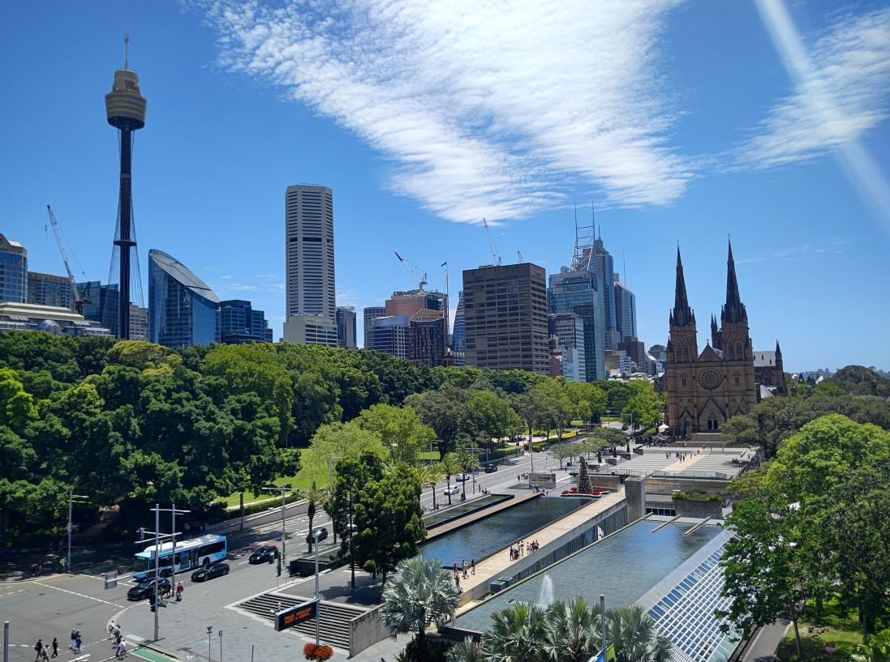
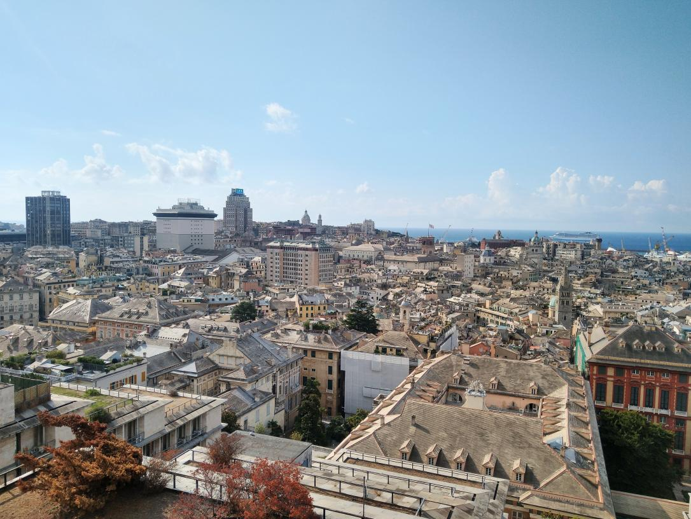
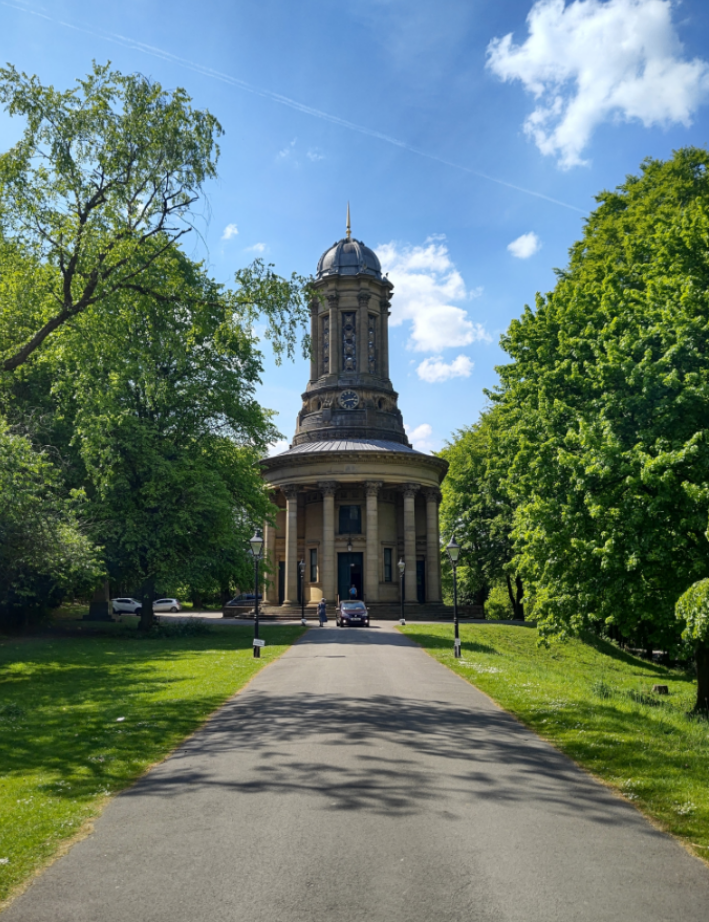
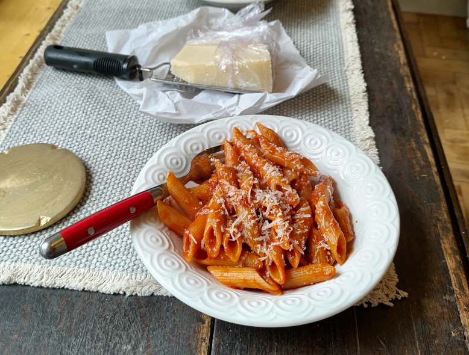

My name is Jon. I have an affinity for solving complex problems. I'm a mechanic by trade , have a PhD in robotics , and am a [Lean Six Sigma](https://en.wikipedia.org/wiki/Lean_Six_Sigma) Black Belt. I'm also interested in topics such as design, philosophy, classical mechanics, (applied) mathematics, and science. My interests are diverse, but I think the common theme is my aptitude for logical thinking, and spatial reasoning.

I also like:
- Good coffee ☕
- Books 📚 (check out my reading list [here](/reading/))
- Solving problems 🧩
- Optimisation 🌀
- Board games 🎲♟️
- Cats 🐈

I've also taken a liking to cooking in the past few years.

> You can find more details on my work experience & education on the left. 👈

> You can find examples of the projects I've worked on, and evidence of my skills in project management, planning, and robot control on the left, too. 👈

### 🧭 Navigation:
- [A Bit of History](#history)
- [Places I've Lived](#places)
- [My Favourite Recipe](#recipe)

## A Bit of History

I went to high school at St Mary's Cathedral College, Sydney (Australia) from 2000 to 2005. From 2001 onwards I chose Visual Arts as an elective. It was my favourite subject (and still is!). I also did Extension 1 English, and loved studying classic literature such Bram Stoker's _Dracula_, and Mary Shelley's _Frankenstein_ (hence my passion for reading). I also did Extension 1 Maths, though I didn't enjoy it so much.

When I left high scool I went to the College of Fine Arts at the University of New South Wales (now UNSW Art & Design). I hated it, so I quit within 6 months and did an apprenticeship as a mechanic instead (fitting & machining to be precise). I turned out to have knack for fixing things. And, because I worked in a factory surrounded by robots, I decided to go study engineering.

I was terrified of failing (maths wasn't my best subject in high school), so I studied extremely hard. I ended up getting top marks in most of my subjects. I realised I had the potential to pursue a PhD. I was fortunate to go straight from my Bachelor's degree to PhD. In 2020 was awarded my doctorate and have been doing research in robotics since.

Simultaneously, whilst doing my bachelor's degree, I received a scholarship to work with Transport for New South Wales (TfNSW) and I became involved with the [Lean Six Sigma](https://en.wikipedia.org/wiki/Lean_Six_Sigma) and Continuous Improvement methodology. I earned my Six Sigma Green Belt whilst working for Sydney Trains. I later completed the Black Belt course with the University of Technology Sydney (UTS) Business School during my doctorate.

I then spent 2 years in [STORM Lab](https://www.stormlabuk.com/) at the University of Leeds.  I am also a guest lecturer and teaching assistant for the Lean Six Sigma [Yellow Belt course](https://www.edx.org/certificates/professional-certificate/tumx-six-sigma-and-lean?webview=false&campaign=Lean+Six+Sigma+Yellow+Belt%3A+Quantitative+Tools+for+Quality+and+Productivity&source=edx&product_category=professional-certificate&placement_url=https%3A%2F%2Fwww.edx.org%2Fcertificates%2Fprofessional-certificate) by the Technical University of Munich (TUM) on [edX.org](https://www.edx.org/).

[🔝 Back to top.](#top)

## Places I've Lived

I'm originally from Sydney, Australia. I lived there until I was 34 years old.

    
     
    <em> A view of Sydney I took from the Australian Museum in January 2024. </em>
     
    <em> On the left you can see Sydney Tower, and on the right, St Mary's Cathedral. </em>

 

Due to the COVID lockdowns and border closures, the Australian universities lost revenue. My contract as a research associate / post doc was not renewed. I had 2 choices: change careers, or find a job abroad. I was fortunate to receive an offer at the _Istituto Italiano di Tecnologia_, in Genova, Italy. I lived there for about 2.5 years, and is still my favourite place.

    
     
    <em> A photo of Genova, Italy I took from the lookout at Castelletto in September 2021. </em>

 

I then took another research position Leeds, England, for 2 years. The weather wasn't always nice 🥶, but the Yorkshire countryside is stunning in Spring and Summer. And I do love a good Sunday roast.

    
     
    <em> A photo of Saltaire United Reform Church, West Yorkshire, England, taken in May 2025. </em>

[🔝 Back to top.](#top)

## My Favourite Recipe: Pasta all'Amatriciana

    
     
    <em> A bowl of penne all'amatriciana that I made. </em>

⏲️ **Total time:** 30 minutes  
🍽️ **Servings:** 4

#### 🛒 Ingredients:
- 400 g spaghetti  
- 150 g guanciale (or pancetta)  
- 400 g canned peeled tomatoes  
- 50 g grated Pecorino Romano  
- 1 tbsp extra virgin olive oil  
- 1 small chili pepper (optional)  
- 50 ml dry white wine 🍷 (e.g., Pinot Grigio)  
- Salt to taste  

#### 🍳 Instructions:
1. **Prepare the sauce:** Dice the guanciale and brown it in a pan with olive oil. Optionally add chili pepper.  
2. **Deglaze:** Add the white wine 🍷 and let it evaporate for 1–2 minutes.  
3. **Add tomatoes:** Crush peeled tomatoes by hand and add to the pan. Simmer for 15–20 minutes.  
4. **Cook pasta:** Boil spaghetti in salted water until al dente.  
5. **Combine:** Drain pasta, add to sauce, and toss with Pecorino Romano.  
6. **Serve:** Sprinkle extra Pecorino on top and serve hot.

You can find a detailed recipe [here](https://www.giallozafferano.com/recipes/Spaghetti-Amatriciana-Bacon-and-tomato-spaghetti.html).

[🔝 Back to top.](#top)
