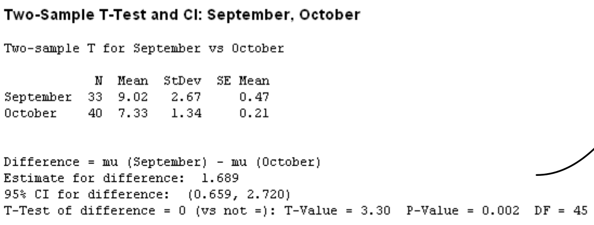
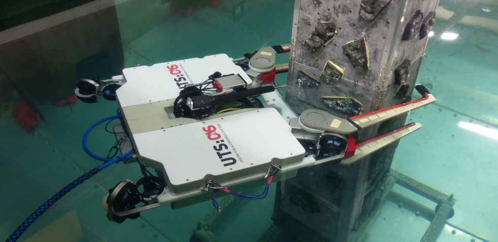

This page contains a comprehensive (but not exhaustive!) list of contributions I've made to projects throughout my career as a professional engineer. It demonstrates the range, and versatility of my skills:
- Team leadership,
- Collaborative project planning,
- Empirical data analysis, and
- Robot control.

I've applied many of the [7 management & planning Tools](https://en.wikipedia.org/wiki/Seven_management_and_planning_tools), the [7 basic tools of qualiy](https://en.wikipedia.org/wiki/Seven_basic_tools_of_quality). There are also some fun robot demonstrations.

## 🧭 Navigation

- [Sydney Trains](#sydney-trains)
  - [Train Inspections](#sydney-trains-inspections)
    - [Root Cause Analysis (Ishikawa Diagram)](#sydney-trains-ishikawa)
    - [Process Mapping](#sydney-trains-process-mapping)
    - [Hypothesis Testing (2-Sample t-Test)](#sydney-trains-hypothesis-testing)
  - [Train Pantographs](#sydney-trains-pantographs)
    - [Process Capability Analysis](#sydney-trains-process-capability)
    - [Root Cause Analysis (Interrelationship Digraph)](#sydney-trains-interrelationship-digraph)
    - [Regression Modeling](#sydney-trains-regression)
- [Submerged Pile Inspection Robot](#submerged-pile-inspection-robot)
  - [Engineering Design Workshop](#spir-workshop)
    - [Brainstorming (Affinity Diagram)](#spir-brainstorming)
    - [Kano Model](#spir-kano-model)
  - [Robot Control](#spir-robot-control)
    - [Cup Balancing](#spir-cup-balancing)
    - [Predictive Control](#spir-predictive-control)
- [ergoCub](#ergocub)
  - [Conference Demo Workshop](#ergocub-workshop)
    - [Brainstorming & Affinity Diagrams](#ergocub-brainstorming)
    - [Task Prioritization Matrix](#ergocub-prioritization-matrix)
    - [Activity Network Diagram](#ergocub-activity-network)
  - [Robot Control](#ergocub-control)
    - [Bimanual Manipulation](#ergocub-bimanual)
    - [Human-Robot Interaction](#ergocub-hri)
- [Terabotics](#terabotics)
  - [Phantom Limb Planning Workshop](#terabotics-workshop)
    - [Critical to Quality Tree](#terabotics-ctq)
    - [Risk Management (Process Decision Program Chart)](#terabotics-pdpc)
    - [Task Planning (Activity Network Diagram)](#terabotics-activity-network)

---

## Sydney Trains

I received an engineering scholarship with Transport for New South Wales (TfNSW) whilst studying for my Bachelor's degree, and worked in the Lean Six Sigma / Continuous Improvement team in the Maintenance Directorate of Sydney Trains.

I did a 3-month sabbatical (from December 2013 to February 2013) as a rail maintainer over summer of my own volition. I then took the initiative to lead 2 of my own improvement projects.

### Train Inspections

There were 6 different teams with 6 different processes for conducting train inspections. The consequence of this was up to 5 hours difference in average completion time, and variance up to 4 hours. The cost of this difference to the business was a (conservative!) $100,000 per year. This was just for the 30-day inspections, on a single train fleet. Extend this to the 90 and 120-day inspections, and all train fleets, and it is potentially millions of dollars in labour hours.

#### Root Cause Analysis (Ishikawa Diagram)

With the help of the rail maintainers, we developed an Ishikawa diagram to brainstorm the potential reasons why there was so much variation in train inspections. Everyone was then given about 3 votes to say what they thought was the most significant factor.

  
   
  <em> An Ishikawa (fishbone) diagram to determine why train inspection were taking so long. </em>

Lack of method, and the paperwork were considered the major causes. In fact, they were tightly interlinked since there was no logic sequencing to the inspection tasks in the paperwork.

#### Process Mapping

During the improvement phase of the projects, I worked with the rail maintainers to lay out the tasks in a logic sequence. We used a combination of swimlanes, to show movement across different levels of the train, and spaghetti diagrams to show movement across its length.

  
  
   
  <em> Optimising the inspection process using swimlanes (left), and spaghetti diagrams (right). </em>

#### Hypothesis Testing (2-Sample t-Test)

The histograms below show the difference in performance between September & October after having implemented the new inspection sequence. There was a distinct change in both the mean (average) time, _and_ the variance.

  
   
  
   
  <em> Histograms for the before-and-after process performance (left), and paired t-test showing statistically significant improvement (right). </em>

### Train Pantographs

Sydney Trains took over the maintenance of the OSCAR train fleet in 2013. On top of the train pantographs (pictured below) is a sacrificial carbon strip. They were wearing out at within 20,000 ~ 30,000 km, instead of the prescribed 80,000 km. This led to a few failures in service, and the overall maintenance cost (materials, downtime, labour hours) was on the order of magnitude of $1,000,000 / year. I ran a Six Sigma project to find out why.

  
   
  <em> The Outser Suburban Car (OSCAR) train, with a single arm pantograph. </em>

#### Process Capability Analysis

Since the carbon strips were wearing out rapidly, its logical to check that the contact force was set correctly. The engineers had specified a contact force of 90N (+-3N). I measured 32 pantographs by hand and check the process capability. About 50% of the force measurements were out of specification.

  
   
  <em> Distribution of contact force settings are outside the specification limits.</em>

There were 2 discoveries during this process:
1. Maintainers were adjusting the wrong spring when setting contact force (there are 2 indentical springs on the pantograph, each with a specific purpose), and
2. The scales issued by the engineers weren't even precise enough to meet this specification.

In hindsight, this highlighted the need to:
1. Conduct a proper gauge study on the scales _first_, and
2. Implement proper poke yoke (error-proofing) on the force adjustment process.

#### Root Cause Analysis (Interrelationship Digraph)

There are many interrelated factors contributing to carbon strip wear, so I applied this sophisticated tool to understand it. It maps out the causal relationship between all the potential factors. For example, a high contact force increases mechanical wear. This is illustrated as $\text{Contact force} \rightarrow \text{Mechanical wear}$. But conversely, a low contact force causes the pantograph to bounce which causes arcing $\text{Contact force} \rightarrow \text{Pan bounce} \rightarrow \text{Arcing}$.

  
   
  <em> This interrelationship digraph (directed graph) shows the complex cause-and-effect of factors contributing to collector strip wear.</em>

The table below summarises the analysis in terms of:
1. Root causes (no arrows in)
2. Symptoms (no arrows out), and
3. Bottlenecks (more arrows in than out)

|        Factor      | Arrows Out | Arrows In |   Comment  |
|--------------------|------------|-----------|------------|
| Contact force      | 2          | 0         | Root cause |
| Overhead voltage   | 1          | 0         | Root cause |
| Wire tension       | 1          | 0         | Root cause |
| Material grade     | 2          | 0         | Root cause |
| Train speed        | 3          | 0         | Root cause |
| Pantograph spacing | 1          | 1         |            |
| No. of strips      | 1          | 2         |            |
| Pan bounce         | 4          | 1         | Bottleneck |
| Train powering     | 1          | 1         |            |
| Pantograph mass    | 1          | 1         |            |
| Current draw       | 2          | 2         |            |
| Arcing             | 1          | 1         |            |
| Wire Oscillations  | 2          | 2         |            |
| Mechanical wear    | 0          | 2         | Symptom    |
| Electrical wear    | 0          | 2         | Symptom    |

The factors that the rollingstock maintenance directorate have control over are contact force, and the material grade. It also highlights important inter-dependencies between other stakeholders, such as the infrastucture maintenance team, rollingstock engineering, etc.

#### Regression Modeling

The large variance in contact force had a silver lining; I was able to fit a regression curve to model the relationship between force and wear. The relationship was statistically significant (albeit weak, due to the numerous factors shown above).

  

The neat thing about this equation was it was quadratic (i.e. a second-order polynomial):
$$
\begin{equation}
    w = 381.5 - 6.74f + 0.03032f^2
\end{equation}
$$
This means I could use calculus to find the optimal contact force:
$$
\begin{align}
    \frac{d w}{d f} = 0.06064f - 6.74 &= 0 \\
                                          f^{\star} &= 111.14
\end{align}
$$
The specification for the force given by rollingstock engineers was 90N. Based on empirical evidence, I calculated 111N. This was much closer to the 120N specified by the manufacturer, Brecknell Willis.

This conforms with the interrelationship digraph; the low contact force was causing the pantograph to bounce, which caused arcing, and electrical wear. This is exactly what we observed from examining the collector strips.

[⬆️ Back to top](#top)

---

## Submerged Pile Inspection Robot

When I started my PhD in 2015, I worked on the [Submerged Pile Inspection Robot (SPIR)](https://web-tools.uts.edu.au/projects/detail.cfm?ProjectId=2013001523). It was funded by the New South Wales Roads & Maritime Services (RMS), and developed by the Universty of Technology Sydney UTS). Its purpose was to assist divers to clean marine growth of bridge piles to enable condition assessment of the underlying surface.

  
   
  <em> The third prototype of the Submerged Pile Inspection Robot (SPIR). </em>

### Engineering Design Workshop

I hosted a design workshop based on some of the skills I had recently learned in the Six Sigma Black Belt course with the UTS Business School. We made comprehensive list of design issues with the previous prototype, and generated ideas on how we could improve the next.

  
   
  <em>Brainstorming and grouping of issues related to assembly & maintenance of the underwater robot.</em>

#### Brainstorming (Affinity Diagram)

For each use case scenario of the robot

- Assembly & maintenance,
- Transportation, and
- Operation,

we brainstormed as many problems as we could think of. We then grouped these in to common themes (affinity diagrams) to make them easier to manage. This allowed us to manage, organise, and prioritise a multitude of requirements.

  
   
  <em>Brainstorming and grouping of issues related to assembly & maintenance of the underwater robot.</em>

#### Kano Model

We used the Kano model to prioritise our efforts for developing the new prototype. It divides a the features of a product or service in to 3 categories:
1. Minimum requirements,
2. Competitive features,
3. Excitement, or innovative features.

  
   
  <em>Using the Kano model to prioritise features in the design of the next prototype.</em>

Everyone on the team was given 5 votes to decide what features they were most important. Team thought that autonomy, and the ability to satisfy cleaning requirements were the 2 most important key performance indicators for the robot.

### Robot Control

My PhD thesis was on the control of robot arms on moving platforms under disturbance (as one might apply to the underwater robot). Below are some examples of the robot control I implemented.

#### Cup Balancing

Admittedly, this control demonstration was just for fun. I used a camera to detect the position & orientation of the base of the robot. I then wrote a real-time feedback control algorithm to try and keep the cup steady.

  
   
  <em> Using real-time feedback control to keep the coffee cup steady. </em>

#### Predictive Control

This demonstration implements the algorithm I wrote in [this paper](https://ieeexplore.ieee.org/abstract/document/9425004). I used time-series forecasting to predict the motion of the target, then used a predictive control algorithm which anticipated its motion. You can see it follows the target almost perfectly.

  
   
  <em> Motion prediction + predictive control enables real-time tracking of a moving target. </em>

[⬆️ Back to top](#top)

---

## ergoCub

I did a postdoc at the _Istituto Italiano di Tecnologia_ from 2021 to 2023. I worked on the [ergoCub project](https://ergocub.eu/); a humanoid robot designed to assist people at work, funded by the National Institute for Insurance Against Accidents at Work (INAIL, in Italian).

### ICRA 2023 Demo Workshop

In early 2023 we scrambled to put together a demonstration for the stakeholders from INAIL. Shortly after, we were told we would have to demonstrate our robotic platform at the [world's largest robotics conference](https://www.icra2023.org/).

I got our team together for a planning workshop to review the last demo's performance, and plan for the next.

#### Brainstorming & Affinity Diagrams

The first part of the workshop was to do silent brainstorming around 3 questions:
1. What did we do well?
2. How might we improve?
3. What can we do to impress people?

We then used [affinity diagrams](https://en.wikipedia.org/wiki/Affinity_diagram) to organise them based on common themes. This made it easier to manage and integrate in to our task planning.

  
   
  
   
  <em> Brainstorming & affinity diagrams reviewing our performance for the demonstration with INAIL. </em>

#### Task Prioritization Matrix

Given that we were short for time, we used this matrix to evaluate their relative importance. Each tasks is rated against every other task. Ratings are summed across the rows. This can then be used to qualify which tasks are most important, and where time and resources should be dedicated.

  
   
  <em> Text </em>

Below is a table showing the score for each of the major tasks. The team (implicitly) determined that having code that works across multiple robot models was most important. This is because there is limited version of each robot, and we frequently had to do demonstrations and testing on different hardware.

| Task                                             | Score (Rounded) |
|--------------------------------------------------|-----------------|
| Code works cross-platform (iCub2,ergoCub,Gazebo) | 116             |
| Robot looks at & follows object                  | 87              |
| Thrift communication                             | 77              |
| Robot can grasp given hand transforms            | 62              |
| Load parameters from config file                 | 41              |
| Presentation of Research Summary                 | 34              |
| Robot can grasp object in different poses        | 33              |
| Robot grabs _different_ objects                  | 11              |
| Robot moves smoothly & naturally                 | 7               |
| Robot moves quickly                              | 2               |

#### Activity Network Diagram

We layed out the tasks in sequence, and determined the dependencies.

  
   
  
   
  <em> Task sequence planning with an activity network (above),   and subsequent Gantt chart in Github projects (below). </em>

### Robot Control

#### Bimanual Manipulation

A core part of my research at IIT on the ergoCub project was [developing a controller to manipulate an object with 2 hands](https://github.com/hsp-iit/ergocub-bimanual). To resolve this, I applied a Pfaffian constraint, that essentially tricked the robot in to thinking the 2 individual arms were part of a single closed chain. Then it was simply a matter of specifying the motion control for the grasped object, and the arm motion was automatically resolved. I used [my own convex optimisation algorithm](https://github.com/Woolfrey/software_simple_qp) to solve this in real time.

  
  
  
   
  <em> A mathematical constraint is used to keep the hands of the robot together. </em>

 

#### Human-Robot Interaction

Part of the project was collaborating with the Humanoid Sensing & Perception team to implement object recognition & human action recognition with robot control. Using a decision tree, the robot as able to respond intelligently to things it saw. This included:
1. Recognising & following a human face,
2. Responding to gestures such as waving, or a handshake,
3. Recognising & following a box, and
4. Recognising when a box is being offered, and grasping it with 2 hands.

[⬆️ Back to top](#top)

---

## Terabotics

I'm currently working as a research fellow at the University of Leeds as part of [this project](https://warwick.ac.uk/fac/sci/physics/research/condensedmatt/ultrafastphotonics/emmasthzgroup/terabotics/). It is an £8,000,000 research grant to integrate THz (high-frequency) sensing in to robotic systems for cancer detection, circumventing the need for biopsy.

### Phantom Limb Planning Workshop

A competition was held amongst the research fellows on the Terabotics project. We were divided in to 3 teams across 3 Univerities, with a mix of research disciplines. We were given 3 hours to develop a research proposal to win £10,000. My team proposed to create an artificial (phantom) limb that would mimic the mechanical and optical properties that could be used for research in contact sensing. We won.

We met at the University of Warwick for a whole-day workshop.

#### Critical to Quality Tree

One of the primary tasks was to determine the engineering specifications. For this we used a "critical to quality" (CTQ) tree which is organised in to 3 (or 4) tiers:
1. A concise description of the product / service.
2. Drivers: Qualitative features that _describe_ a good product / service.
3. CTQ: Quantitative metrics, and
4. A unit of measurement (optional).

  
   
  
   
  <em> The initial critical-to-quality tree which elucidated all the engineering specifications for a successful, functional prototype. </em>

One of the interesting outcomes during discussions was that the skin slowly depresses under contact. It appears as an exponentially decaying curve when plotted. We can quantify this using the time constant $\tau$:
$$
  x(t) = e^{-t/\tau}x_0.
$$

#### Risk Planning (Process Decision Program Chart)

Since the development of this phantom limb was a novel endeavour, and we have to coordinate across multiple universities in different counties, there were many unknown risk factors. We used the Process Decision Program Chart (PDCP) to address this. It is organised in to 5 tiers:
1. The major goal for the project.
2. Major tasks to be completed.
3. Sub-tasks needed to complete the major tasks.
4. Potential risks to the project.
5. Potential counter-measures.

  
   
  <em> Brainstorming was used to identify potential risks (in pink), and countermeasures.</em>

The countermeasures were then integrated in to the task planning as a form of risk prevention.

#### Task Planning (Activity Network Diagram)

The sub-tasks and countermeasures from the PDCP above were arranged in sequence using an activity network diagram below.

  
   
  <em> Planning task sequencing & dependencies using an activity network diagram. </em>

This was then used to generate a Gantt chart in Github projects. The points at which multiple tasks converge can be used as project milestones.

[⬆️ Back to top](#top)
