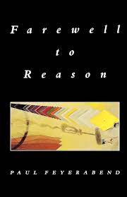
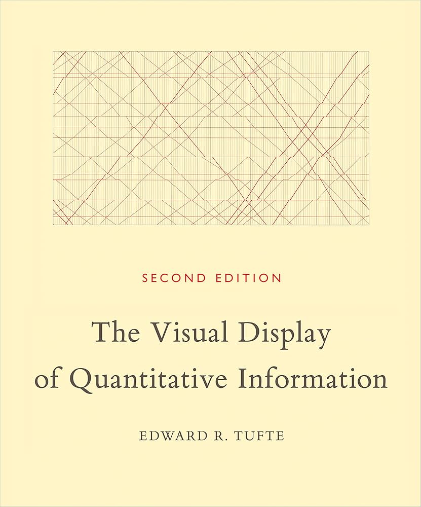
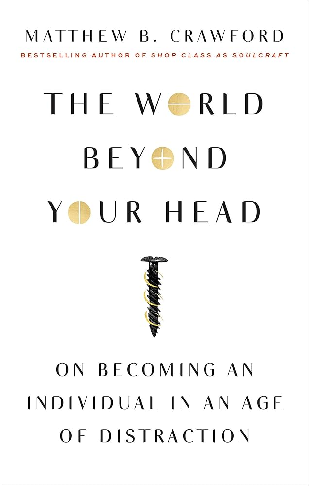

People often ask me what kind of books they should read. The answer is: anything that interests you! But otherwise, here is a list of books I have read that I find compelling in some way.

>❗ _If you work with data of any kind, I highly recommend the following (all by Edward Tufte)_:
> 1. _The Visual Display of Quantitative Information_
> 2. _Envisioning Information_
> 3. _Visual Explanations_

 

| | Title | Author | Categories |
|-|-------|--------|------------|
| | Action in Perception | Alva Noe | perception, philosophy |
| | Bad Science | Ben Goldacre | science, statistics, medicine |
| | Beautiful Evidence | Edward Tufte | statistics, graphics, charts, diagrams |
| | Biomimicry : Innovation Inspired by Nature | Janine Benyus | design, problem solving, systems thinking |
|| Book of Why, The | Judea Pearl | statistics, computer science, A.I. |
| | Brutal Simplicity of Thought | Lord Saatchi | philosophy? |
| | Case for Working With Your Hands, The | Matthew Crawford | philosophy, work, management, epsitemology |
| | Change by Design | Tim Brown | design, problem solving, business |
| | Data Analysis for Politics & Policy | Edward Tufte | statistics, management |
| | Delft Design Guide, The | TU Delft | design, problem solving, engineering |
| | Design of Everyday Things, The | Don Norman | design, psychology, human error |
|| End of Science, The | John Horgan | science |
|| Envisioning Information | Edward Tufte | statistics, graphics, charts, diagrams |
| | Farewell to Reason | Paul Feyerabend | philosophy, science |
| | Human Error | James Reason | human error, psychology, management |
| | I Think You'll Find It's a Bit More Complicated Than That | Ben Goldacre | science, statistics, medicine |
| | Lateral Thinking | Edward de Bono | creativity, problem solving |
| | Life Changing Magic of Tidying Up, The | Marie Kondo | wellbeing |
| | Living with Complexity | Don Norman | design, psychology |
| | Logic of Scientific Discovery, The | Karl Popper | philosophy, science |
| | Lost In Math | Sabine Hossenfelder | maths, physics, science |
| | Mathematics and Art : A Cultural History | Lynn Gamwell | art, mathematics, culture |
| | Noise : A Flaw in Human Judgement | Daniel Kahneman, Olivier Sibony, Cass Sunstein | psychology, management |
| | Principles of Scientific Management, The | Frederick Taylor | management, production, lean |
| | Signal & The Noise: The Art and Science of Prediction, The | Nate Silver | statistics, data, prediction, forecasting |
| | Six Thinking Hats | Edward de Bono | creativity, problem solving, management |
| | Solving Complex Problems | Alexander de Haan | systems thinking, problem solving |
| | Start With Why | Simon Sinek | management, business, philosophy |
| | Strategic Design | Giulia Calabretta | design, management, business |
| | Structure of Scientific Revolutions, The | Thomas Kuhn | science, philosophy |
| | Thinking, Fast and Slow | Daniel Kahneman | psychology, management, human error |
| | Thinking in Systems : A Primer | Donella Meadows | systems thinking, problem solving |
| | To Be A Machine | Mark O'Connell | philosophy, science, A.I. |
| | Today and Tomorrow | Henry Ford | management, production, lean, business |
| | Toyota Production System : Beyond Large Scale Production | Taiichi Ohno | management, production, lean |
| | Toyota Way : 14 Management Principles from the World's Greatest Manufacturer, The | Jeffrey Liker | management, production, lean, business|
| | Visual Display of Quantitative Information, The | Edward Tufte | statistics, graphics, charts, diagrams |
| | Visual Explanations | Edward Tufte | statistics, graphics, charts, diagrams |
| | World Beyond Your Head, The | Matthew Crawford | philosophy, wellbeing, perception |
| | Zen and the Art of Motorcycle Maintenance | Robert Pirsig | philosophy |

[⬆️ Back to top.](#top)
