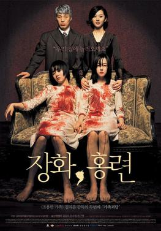
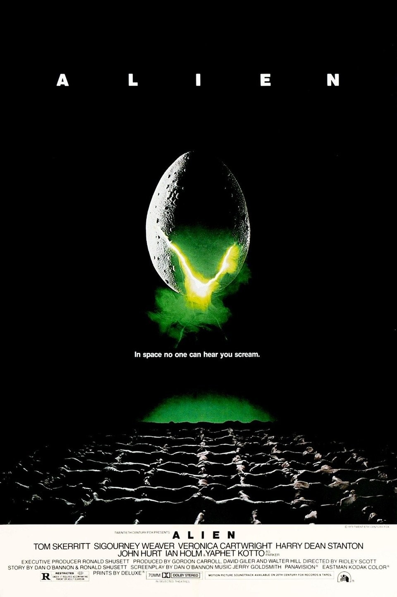
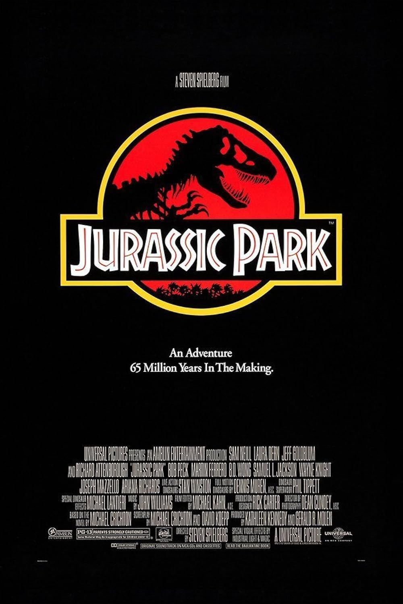

| | Title | Year | Director | Genre |
|-|-------|------|----------|-------|
|  | A Tale of Two Sisters | 2004 | Kim Jee-woon | horror, mystery |
|  | After Midnight | 2019 | Jeremy Gardner, Christian Stella | drama, horror |
|  | A.I.: Artificial Intelligence | 2001 | Steven Spielberg | science fiction |
|  | Akira | 1988 | Katsuhiro Otomo | science fiction |
|  | Alien | 1979 | Ridley Scott | horror, science fiction |
|  | Aliens | 1986 | Ridley Scott | action, horror, science fiction |
|  | Annihilation | 2018 | Alex Garland | horror, science fiction |
| | Apocalypto | 2006 | Mel Gibson | action, adventure |
|  | Battle Royale | 2001 | Kinji Fukasaku | action, drama |
| | Color Out of Space, The | 2020 | Richard Stanley | horror, science fiction |
|  | Crouching Tiger, Hidden Dragon | Ang Lee | action, drama |
|  | Curse of the Golden Flower | 2007 | Zhang Yimou | action, drama |
|  | Descent, The | 2005 | Neil Marshall | horror |
|  | Dark Knight, The | 2008 | Christopher Nolan | action |
|  | Edge of Tomorrow, The | 2014 | Doug Liman | action, science fiction |
| | Empire Strikes Back, The | 1980 | Irvin Kershner  | fantasy, science fiction |
| | Endless, The | 2017 | Justin Benson, Aaron Moorhead | horror, science fiction |
|  | End of Evangelion, The | 1997 | Hideaki Anno, Kazuya Tsurumaki | action, science fiction |
|  | Hereditary | 2018 | Ari Aster | horror |
|  | Interstellar | 2014 | Christopher Nolan | science fiction |
|  | It Follows | 2015 | David Robert Mitchell | horror |
|  | Jurassic Park | 1993 | Steven Spielberg | action, science fiction |
| | Kill Bill: Vol. 1 | 2003 | Quentin Tarantino | action |
|  | Kumiko The Treasure Hunter | 2014 | David Zellner | comedy, adventure |
|  | Kung Fu Hustle | 2005 | Stephen Chow | action, comedy |
|  | Little Miss Sunshine | 2006 | Valerie Faris, Jonathan Dayton | comedy |
|  | Man From Nowhere, The | 2010 | Lee Jeong-beom | action, thriller |
|  | Melancholia | 2011 | Lars von Trier | drama |
|  | Menu, The | 2022 | Mark Mylod | drama, thriller |
|  | My Neighbour Totoro | 1989 | Hayao Miyazaki | fantasy |
|  | Moon | 2009 | Duncan Jones | science fiction |
|  | Nausicaa of the Valley of the Wind | 1984 | Hayao Miyazaki | action, fantasy, science fiction |
| | Neon Genesis Evangelion | 1995 | Hideaki Anno | science fiction |
|  | Nightcrawler | 2014 | Dan Gilroy | thriller |
|  | Oldboy | 2003 | Park Chan-wook | action, revenge |
|  | Princess Mononoke | 2001 | Hayao Miyazaki | fantasy |
|  | Redbelt | 2008 | David Mamet | action, drama |
|  | Revenant, The | 2015 | Alejandro G. Iñárritu | action, western |
|  | Ring, The | 2002 | Gore Verbinski | horror |s
|  | Samurai Jack |2001 | Genndy Tartakovsky | action, science fiction |
|  | Saw | 2004 | James Wan | horror, thriller |
| | Snowpiercer | 2013 | Bong Joon Ho | action, science fiction |
| | Spirited Away | 2001 | Hayao Miyazaki | fantasy |
| | Synchronic | 2019 | Aaron Moorhead | science fiction, thriller |
|  | Teenage Mutant Ninja Turtles | 1990 | Steve Barron | action |
|  | Terminator 2: Judgement Day | 1991 | James Cameron | action, science fiction |
| | Thing, The | 1982 | John Carpenter | horror, science fiction |
|  | Trigun | 2010 | Satoshi Nishimura | action, comedy |
|  | Tokyo Gore Police | 2008 | Yoshihiro Nishimura | action, horror, science fiction |
|  | White Chicks | 2004 | Keenen Ivory Wayans | comedy |
|  | Witch, The | 2015 | Robert Eggers | horror |

[🔝 Back to top.](#top)